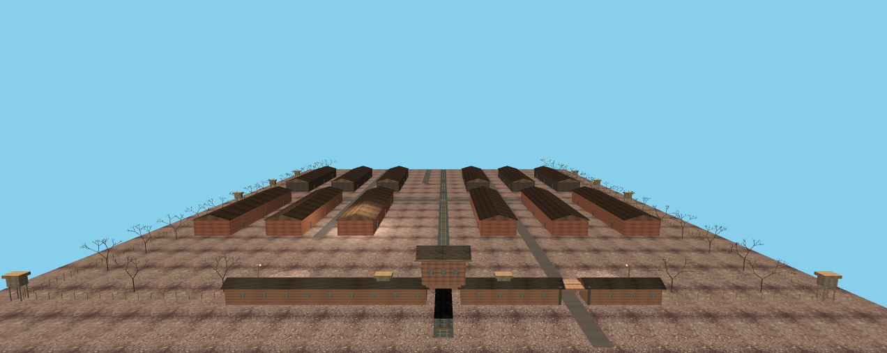
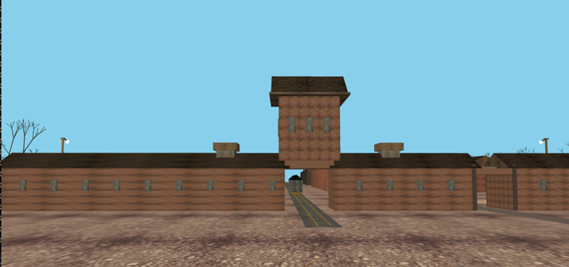
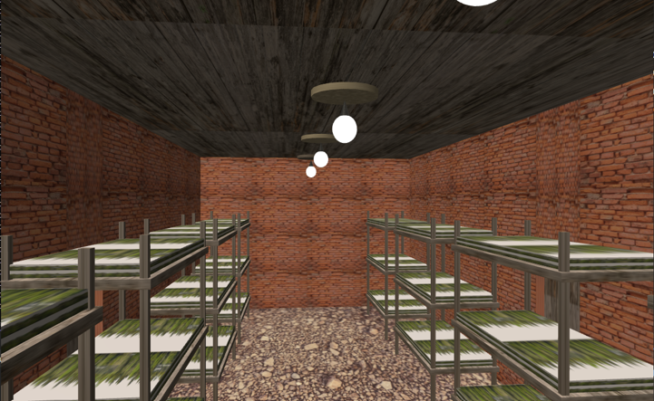
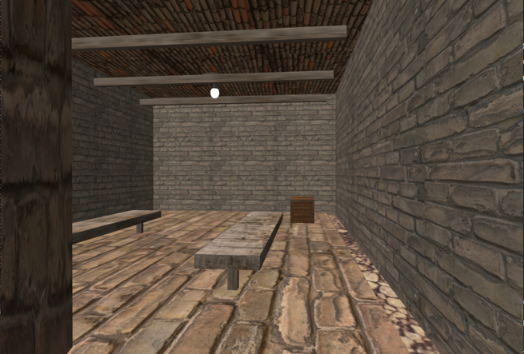
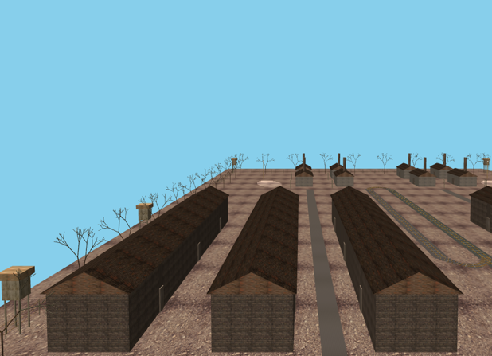
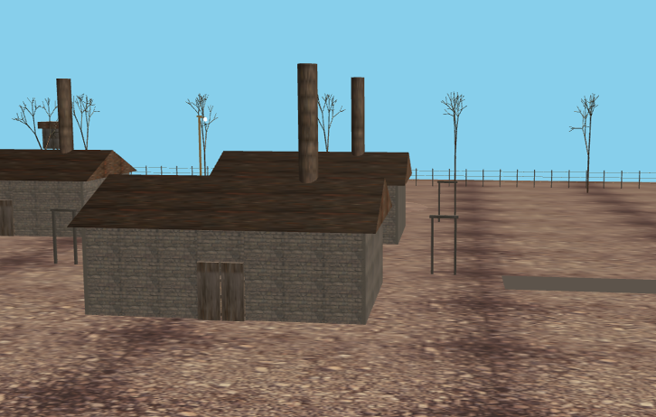
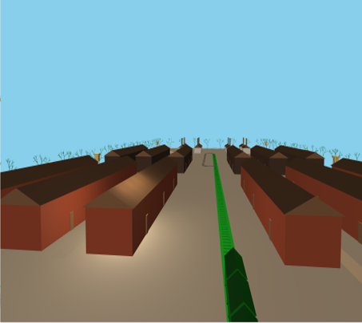
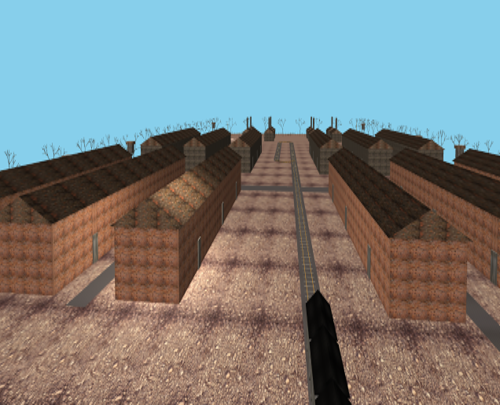
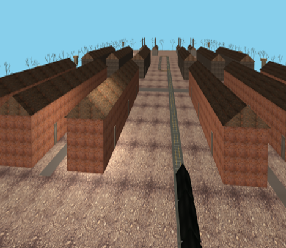

# Auschwitz I Interactive 3D Educational Reconstruction

An OpenGL 3D educational reconstruction of Auschwitz I built with C++, GLFW, GLAD, GLM, and stb_image. The project renders the camp as a navigable scene with custom geometry, textured surfaces, lighting controls, and multiple camera modes.

## Video

- Project video: https://youtu.be/ueYzalv7_38

## Screenshots

<table>
	<tr>
		<td></td>
		<td></td>
	</tr>
	<tr>
		<td></td>
		<td></td>
	</tr>
	<tr>
		<td></td>
		<td></td>
	</tr>
</table>

## Render Modes

<table>
	<tr>
		<td></td>
		<td></td>
	</tr>
	<tr>
		<td></td>
		<td></td>
	</tr>
</table>

## Features

- Recreated camp layout with dedicated scene zones for the entrance, barracks, fence system, environment, and crematory area.
- First-person camera navigation with mouse look and zoom.
- Toggleable wireframe mode.
- Toggleable directional, point, and spot lighting.
- Switchable ambient, diffuse, and specular lighting components.
- Texture display modes for untextured, textured, and blended rendering.
- Interactive barrack doors.
- Quad view mode with top, isometric, front, and free-camera perspectives.
- Train movement controls for the scene animation.

## Requirements

- Windows 10 or newer.
- Visual Studio with the C++ desktop workload installed.
- OpenGL 3.3 capable graphics hardware and drivers.
- GLFW, GLAD, GLM, and stb_image available to the project.

## Controls

- `W`, `A`, `S`, `D` - move the camera horizontally.
- `Space` - move up.
- `C` - move down.
- `Left Shift` - sprint.
- Arrow keys - rotate the camera view.
- Mouse - look around when mouse capture is enabled.
- Mouse wheel - zoom the camera.
- `M` - toggle mouse capture.
- Left mouse button - capture the mouse once.
- `F` - toggle wireframe mode.
- `1` - toggle directional light.
- `2` - toggle point lights.
- `3` - toggle spot lights.
- `4` - cycle texture display mode.
- `5` - toggle ambient lighting.
- `6` - toggle diffuse lighting.
- `7` - toggle specular lighting.
- `8` - open or close the barrack doors.
- `V` - toggle quad view mode.
- `I` - move the train forward.
- `K` - move the train backward.
- `Esc` - exit the application.

## Project Structure

- `src/` - application logic, scene assembly, geometry, and zone definitions.
- `src/primitives/` - reusable primitive meshes such as cubes, cylinders, planes, and spheres.
- `src/zones/` - higher level camp areas and environmental systems.
- `shaders/` - vertex and fragment shaders for Phong lighting.
- `textures/` - image assets used across the scene.
- `Camera.h`, `Shader.h` - core rendering helpers.
- `stb_image.cpp`, `stb_image.h` - texture loading support.

## Notes

- The project is configured for a console application with OpenGL rendering.
- Paths to local dependencies are currently absolute in the Visual Studio project file.
- If you add new assets or source files, make sure they are included in the project so they are compiled and packaged correctly.
